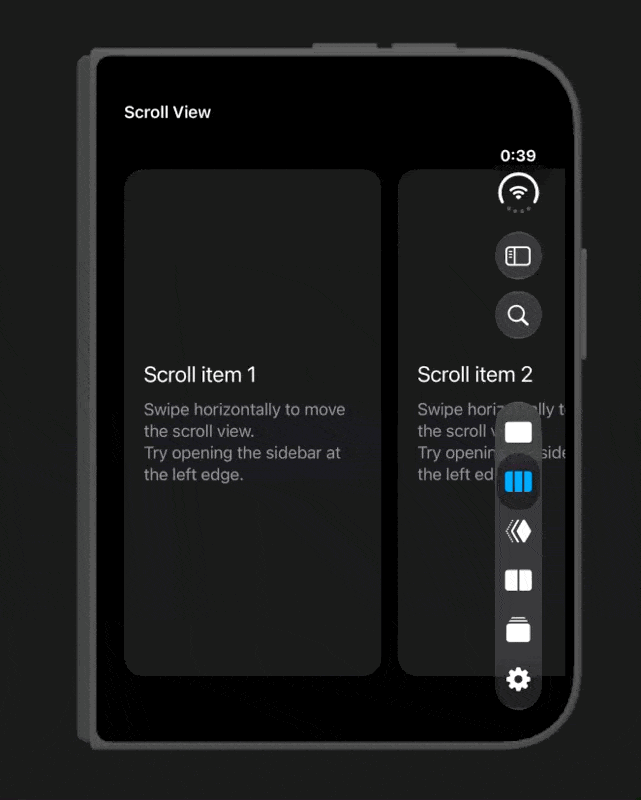

# SidebarPresentation

SidebarPresentation is a UIKit library for building interactive sidebars on iOS.

Supports iOS 18 and later.



## Products

The package provides two layers:

| Product | Use it when |
| --- | --- |
| `AlternativeSidebar` | You want a ready-to-use sidebar for a `UITabBarController` with native-sidebar fallback support. |
| `SidebarPresentation` | You want to provide your own sidebar view controller, presentation style, width, or transition behavior. |

`AlternativeSidebar` uses `SidebarPresentation` internally.

## Installation

Add the package to your Swift package dependencies:

```swift
dependencies: [
    .package(
        url: "https://github.com/noppefoxwolf/SidebarPresentation",
        from: "0.5.0"
    )
]
```

Then choose the product that matches your needs:

```swift
.target(
    name: "YourApp",
    dependencies: [
        .product(
            name: "AlternativeSidebar",
            package: "SidebarPresentation"
        )
    ]
)
```

Use `.product(name: "SidebarPresentation", package: "SidebarPresentation")` instead when building a custom presentation.

## Ready-to-use sidebar

Import `AlternativeSidebar` and access the convenience APIs on your tab bar controller:

```swift
import AlternativeSidebar
import UIKit

@MainActor
final class TabBarController: UITabBarController {
    func presentSidebar() {
        preferredSidebar.isHidden.toggle()
    }

    func configureSidebars() {
        let header = UIListContentConfiguration.header()
        let footer = UIListContentConfiguration.footer()

        // Configure the native and alternative sidebars independently.
        sidebar.headerContentConfiguration = header
        sidebar.footerContentConfiguration = footer
        sidebar.bottomBarView = makeSidebarBottomView()

        alternativeSidebar.headerContentConfiguration = header
        alternativeSidebar.footerContentConfiguration = footer
        alternativeSidebar.bottomBarView = makeSidebarBottomView()
    }

    private func makeSidebarBottomView() -> UIView {
        UIView()
    }
}
```

`preferredSidebar` presents the native `sidebar` when it is available on iOS 27 and later. Otherwise, it presents `alternativeSidebar`. On iOS 26 and earlier, the alternative interaction is enabled only in a compact horizontal size class.

Accessing `alternativeSidebar` creates and installs its interaction automatically. It provides configuration for the header, footer, and bottom view, manages tab selection, and dismisses the sidebar after a tab is selected.

Use `alternativeSidebar.isEnabled` to disable the fallback interaction and `alternativeSidebar.isHidden` to control it directly.

## Custom presentation

Use the `SidebarPresentation` product when you need full control over the sidebar view controller and presentation behavior:

```swift
import SidebarPresentation
import UIKit

@MainActor
final class ViewController: UIViewController, SidebarInteractionDelegate {
    private lazy var sidebarInteraction = SidebarInteraction(
        delegate: self,
        presentation: .modal
    )

    override func viewDidLoad() {
        super.viewDidLoad()
        view.addInteraction(sidebarInteraction)
    }

    func presentSidebar() {
        sidebarInteraction.present()
    }

    func viewController(for interaction: SidebarInteraction) -> UIViewController {
        self
    }

    func sidebarInteraction(
        _ interaction: SidebarInteraction,
        widthForSidebar sidebarViewController: UIViewController
    ) -> CGFloat {
        SidebarTransitionController.defaultSidebarWidth
    }

    func sidebarInteraction(
        _ interaction: SidebarInteraction,
        presentingViewControllerFor viewController: UIViewController
    ) -> UIViewController? {
        CustomSidebarViewController()
    }
}
```

Choose `.embedded` instead of `.modal` when the sidebar should be embedded in the presenting view controller:

```swift
let interaction = SidebarInteraction(
    delegate: self,
    presentation: .embedded
)
view.addInteraction(interaction)
```

For lower-level transition control, use `SidebarTransitionController` directly as a view controller transitioning delegate.

## Build and test

This repository is an iOS Swift package. Use `xcodebuild` with an iOS Simulator destination.

List available simulator destinations:

```sh
xcodebuild -scheme SidebarPresentation -sdk iphonesimulator -showdestinations
```

Build the package:

```sh
xcodebuild \
    -scheme SidebarPresentation \
    -destination 'generic/platform=iOS Simulator' \
    build
```

Run tests on a specific simulator:

```sh
xcodebuild \
    -scheme SidebarPresentation \
    -destination 'platform=iOS Simulator,name=iPhone 17 Pro,OS=26.5' \
    test
```

Build the Example app:

```sh
cd Example.swiftpm
xcodebuild \
    -scheme Playground \
    -destination 'generic/platform=iOS Simulator' \
    build
```

## Contributing

Bug reports and pull requests are welcome.

## Apps using SidebarPresentation

<p float="left">
    <a href="https://apps.apple.com/app/id1668645019"></a>
</p>

## License

This project is licensed under the terms of the MIT license. See the [LICENSE](LICENSE) file for details.
